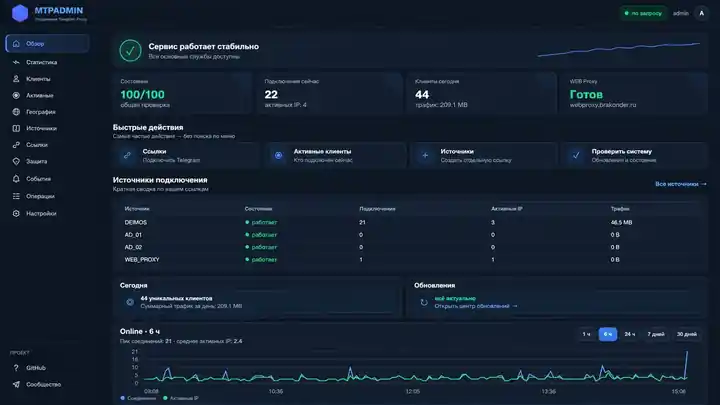
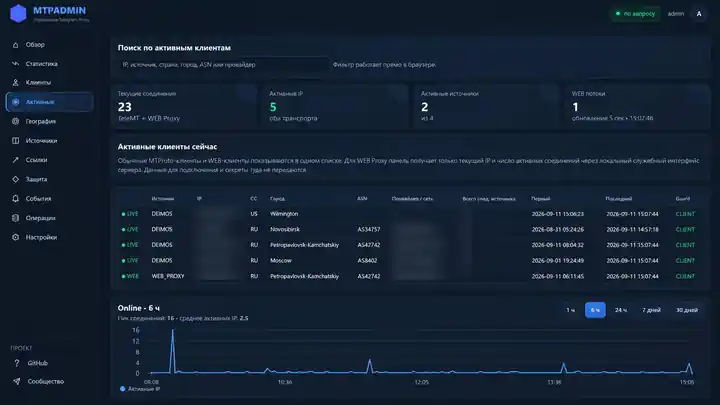
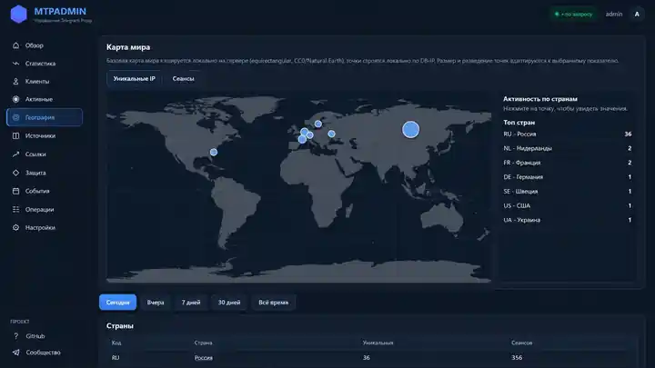
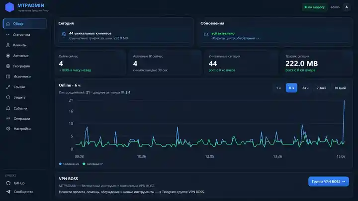

# MTPADMIN — свой Telegram Proxy с веб-панелью

[Русский](README.md) · [Українська](README.uk.md) · [فارسی](README.fa.md) · [简体中文](README.zh-CN.md) · [Türkçe](README.tr.md) · [العربية](README.ar.md) · [English](README.en.md)

**MTPADMIN помогает за несколько минут поднять свой прокси для Telegram на обычном сервере и дальше управлять им через понятную веб-панель.**

Текущая версия: **0.12.5**  
Статус: **открытое тестирование**. Обновление уже работающей установки проверено на реальном сервере. Сейчас особенно нужны отзывы о чистой установке на разных серверах и версиях Debian/Ubuntu.

После установки у вас будет два способа подключения:

- обычный **MTProto Proxy**;
- **Telegram WEB Proxy** через HTTPS.

В панели можно посмотреть активных пользователей, статистику, страны и сети, создать отдельные ссылки для друзей или рекламы, проверить состояние сервера и установить обновления.

> Один раз установили — дальше почти всё делается через браузер.

[VPN BOSS](https://brakonder.ru) · [Помощь и обсуждение в Telegram](https://t.me/boss_of_this_vpn)

---

## Как выглядит MTPADMIN

Главный экран сразу показывает состояние сервера, подключения, источники и обновления.



<table>
  <tr>
    <td width="50%" valign="top">
      <br>
      <sub><b>Активные клиенты</b> — кто подключён прямо сейчас.</sub>
    </td>
    <td width="50%" valign="top">
      <br>
      <sub><b>География</b> — страны и распределение подключений.</sub>
    </td>
  </tr>
  <tr>
    
    <td width="50%" valign="top">
      <br>
      <sub><b>Статистика</b> — онлайн, трафик и динамика за выбранный период.</sub>
    </td>
  </tr>
</table>

---

## Что умеет MTPADMIN

- создаёт готовые ссылки и QR-коды для подключения;
- показывает, сколько людей подключено сейчас;
- ведёт статистику по дням и источникам;
- показывает страну, город и сеть клиента;
- позволяет делать отдельные ссылки, например «друзья», «сайт» или «реклама»;
- проверяет состояние прокси и веб-панели;
- обновляет MTPADMIN, TeleMT и Telegram WEB Proxy прямо из браузера;
- сохраняет уже розданную ссылку WEB Proxy при обычном обновлении;
- умеет работать как приложение на телефоне через установку сайта на главный экран;
- имеет Scanner Guard для просмотра подозрительной активности. Автоматическая блокировка по умолчанию выключена.

География определяется прямо на вашем сервере. Список IP клиентов не отправляется во внешний сервис для определения города или страны.

---

## Что нужно перед установкой

Подойдёт чистый сервер с:

- **Debian или Ubuntu**;
- обычной 64-битной архитектурой x86-64 или ARM64;
- публичным IPv4;
- доступом `root` или `sudo`;
- минимум **1 ГБ свободного места**;
- доменными именами, которые уже указывают на этот сервер.

Удобнее всего подготовить три имени:

```text
proxy.example.com       — обычный MTProto Proxy
panel.example.com       — веб-панель MTPADMIN
webproxy.example.com    — Telegram WEB Proxy
```

Для веб-панели и WEB Proxy должны быть доступны порты `80` и `443`. Для обычного MTProto нужно открыть выбранный порт, например `8443`.

MTPADMIN не меняет ваши настройки SSH и не переписывает весь межсетевой экран. Для внутренних частей WEB Proxy он добавляет только своё защитное правило, чтобы служебные порты не были доступны из интернета.

---

## Установка

Откройте SSH на сервере и выполните:

```bash
curl -fsSL https://raw.githubusercontent.com/us-chernetskii-k-g/mtpadmin/main/install.sh | sudo bash
```

Дальше появится мастер установки. Он сам спросит домены, IP сервера, порт прокси, имя первого источника, пароль веб-панели и дополнительные параметры, если они нужны.

Перед началом установки вы увидите итоговую сводку и сможете отказаться, если что-то указано неправильно.

Установщик проверяет адреса, домены и основные файлы ещё до того, как начнёт менять систему. Если сеть временно пропадёт во время загрузки, он повторит попытку несколько раз.

---

## После установки

Откройте адрес своей панели, например:

```text
https://panel.example.com/
```

Войдите под логином и паролем, которые указали при установке.

Дальше обычно достаточно:

1. открыть раздел **«Ссылки»**;
2. добавить прокси в Telegram по ссылке или QR-коду;
3. открыть **«Активные»**, чтобы увидеть подключения;
4. иногда заходить в **«Операции» → «Обновления»**.

Для полной проверки сервера есть одна команда:

```bash
mtpadmin doctor
```

Если всё хорошо, в конце будет:

```text
RESULT: HEALTHY
```

---

## Обновления

Основной способ — через веб-панель: **Операции → Обновления**.

MTPADMIN отдельно показывает обновления для самой панели, TeleMT и Telegram WEB Proxy. Обновление продолжится, даже если закрыть вкладку браузера.

Если панель временно недоступна, можно обновиться из консоли:

```bash
curl -fsSL https://raw.githubusercontent.com/us-chernetskii-k-g/mtpadmin/main/update.sh | sudo bash
```

Перед важными изменениями создаются резервные копии, а после обновления система сама проверяет, что службы снова работают.

---

## Сейчас идёт открытое тестирование 0.12.5

На реальном сервере уже проверены обновление MTPADMIN, TeleMT и Telegram WEB Proxy, сохранение рабочей WEB-ссылки, переход на новый постоянный ключ WEB Proxy, восстановление статистики после обновления, правильное отображение версий в Центре обновлений и итоговая проверка `mtpadmin doctor` без ошибок.

Особенно нужны отзывы от тех, кто ставит MTPADMIN **на чистый сервер с нуля**.

Если нашли проблему, пришлите:

```bash
mtpadmin doctor
systemctl --failed --no-pager
```

Не публикуйте пароли, секреты прокси и содержимое файлов с ключами.

---

## Частые вопросы

### Это VPN?

Нет. MTPADMIN делает прокси именно для Telegram. Он не пропускает через себя весь интернет-трафик телефона или компьютера.

### Можно пользоваться без SSH после установки?

Да. Почти всё обычное управление доступно через веб-панель.

### Сломается ли WEB-ссылка после обновления?

При штатном обновлении домен и секрет существующей ссылки сохраняются и дополнительно проверяются.

### Можно поставить панель на телефон как приложение?

Да. На телефоне MTPADMIN можно добавить на главный экран и открывать как отдельное приложение.

### Нужно ли получать рекламную метку у @MTProxyBot?

Нет. Она необязательна.

---

<details>
<summary><b>Для тех, кому интересно, что находится внутри</b></summary>

Обычный MTProto работает через **TeleMT**. Telegram WEB Proxy использует **tproxy-server**, официальный **Telegram MTProxy** и **Caddy** для HTTPS. Статистика хранится локально в SQLite, службы запускаются через systemd.

В обычной работе знать эти названия не нужно — MTPADMIN сам устанавливает и проверяет необходимые части.

</details>

---

## Поддержать разработку

MTPADMIN бесплатный. Разработка, тестовые серверы и проверка обновлений требуют времени и инфраструктуры.

**СБП / МИР:** [поддержать через YooKassa](https://yookassa.ru/my/i/aoLKJEpmtnnX/l)

**USDT · TON**

```text
UQCjpkzF3YQKSXZUu7jxETBndx8qx6M21M4QtTKwi8_Ee2A1
```

**USDT · BEP-20**

```text
0xe93f304d4828c0dbc6667dd2761eb7b07e325ed4
```

**USDT · TRC-20**

```text
TFkFVRq9PEcSe4xbYG5NF24srPCjsPrizR
```

Сообщения об ошибках и предложения по улучшению приветствуются.
