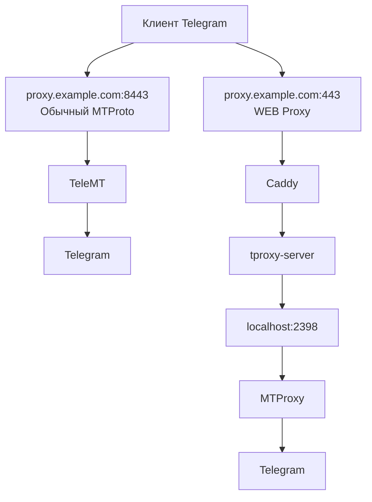
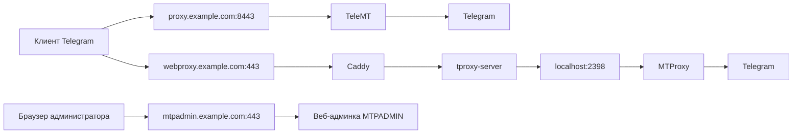
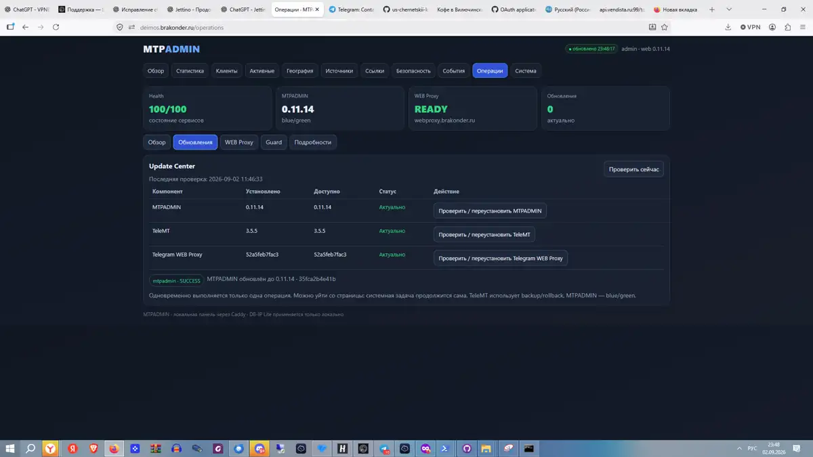

# MTPADMIN — свой Telegram Proxy с веб-админкой

**MTPADMIN помогает поднять собственный Telegram Proxy на VPS и дальше управлять им через удобную веб-панель.**

После установки у вас будут готовые ссылки и QR-коды для подключения, статистика, список активных клиентов, отдельные источники для рекламы и друзей, проверка состояния сервера и обновления прямо из браузера.

Исходный код открыт на GitHub. MTPADMIN входит в экосистему **VPN BOSS**.

> Установили один раз — дальше почти всё можно делать через веб-панель, без постоянной работы в консоли.

[**VPN BOSS**](https://brakonder.ru) · [**Новости, помощь и обсуждение в Telegram**](https://t.me/boss_of_this_vpn)

---

## Что вы получаете

MTPADMIN устанавливает сразу два варианта подключения к Telegram.

| Возможность | Обычный MTProto Proxy | Telegram WEB Proxy |
|---|---:|---:|
| Подключение к Telegram | ✅ | ✅ |
| Готовая ссылка и QR-код | ✅ | ✅ |
| Управление из веб-панели | ✅ | ✅ |
| Активные клиенты | ✅ | ✅ |
| Страна, город и ASN | ✅ | ✅ |
| Статистика | ✅ | ✅ |
| Проверка и восстановление | ✅ | ✅ |

### Обычный MTProto Proxy

Работает через **TeleMT**. Порт задаётся при установке, обычно используется `8443`.

### Новый Telegram WEB Proxy

Работает через обычный HTTPS на порту `443`. Для него можно использовать отдельное имя, например:

```text
webproxy.example.com
```

WEB Proxy встроен в MTPADMIN. Отдельную программу для управления им ставить не нужно.

---

# Как устроено подключение

## Вариант 1 — MTProto и WEB Proxy на одном домене

Это допустимая схема. Конфликта нет, потому что используются разные порты.



То есть один и тот же домен может обслуживать:

```text
proxy.example.com:8443  — обычный MTProto
proxy.example.com:443   — WEB Proxy
```

Внутренний `MTProxy` для WEB Proxy слушает только локальный адрес сервера. Наружу для WEB Proxy открыт HTTPS на `443`.

## Вариант 2 — рекомендуемая схема MTPADMIN

Для понятности и удобства обслуживания рекомендуется использовать отдельные имена.



Рекомендуемый набор имён:

```text
proxy.example.com       — обычный MTProto Proxy
webproxy.example.com    — Telegram WEB Proxy
mtpadmin.example.com    — веб-админка
```

Обычный MTProto при желании можно совместить по имени с одним из HTTPS-сервисов, потому что он работает на другом порту. А вот веб-админку и WEB Proxy в штатной схеме лучше держать на разных именах: оба используют HTTPS на `443`.

---

# Веб-админка

После установки MTPADMIN открывается в браузере по вашему домену, например:

```text
https://mtpadmin.example.com/
```

Доступ защищён логином и паролем, которые вы задаёте при установке.

Начиная с версии **0.12.0**, панель полностью переработана: на компьютере используется удобное боковое меню, на телефоне — нижняя навигация, основные показатели вынесены на первый экран, а служебные сведения спрятаны в отдельный раздел «Для специалистов».

## Установка на телефон

Начиная с версии **0.12.2**, при первом входе с телефона MTPADMIN предлагает установить панель как отдельное приложение.

После установки:

- на главном экране появляется отдельный значок MTPADMIN;
- панель открывается без адресной строки и лишних элементов браузера;
- на Android используется штатное окно установки браузера;
- на iPhone показывается короткая инструкция «Поделиться» → «На экран Домой»;
- если выбрать «Продолжить в браузере», предложение не будет появляться снова в течение 14 дней.

MTPADMIN **не сохраняет страницы админки и статистику для работы без сети**. Установленное приложение всегда получает актуальные данные с вашего сервера. Это сделано специально, чтобы после обновления или перезапуска не показывалась устаревшая информация.

## Как выглядит панель

Ниже — реальные снимки работающей установки MTPADMIN.

### Активные клиенты

Здесь обычные MTProto-клиенты и пользователи WEB Proxy показываются в одном списке. Видны источник, IP, страна, город, ASN, сеть и время активности.


### Обновления

MTPADMIN, TeleMT и Telegram WEB Proxy проверяются и обновляются отдельно. Обновление выполняется на сервере и не зависит от того, оставили вы вкладку браузера открытой или закрыли её.



## Обзор

На главной странице видно состояние основных частей системы:

- обычного MTProto Proxy;
- Telegram WEB Proxy;
- текущих подключений;
- активных IP;
- статистики за день;
- доступных обновлений.

Частые действия — ссылки подключения, активные клиенты, источники и проверка системы — доступны прямо с главной страницы.

## Активные клиенты

Обычные MTProto-клиенты и пользователи WEB Proxy показываются **в одном списке**.

Для активного клиента можно увидеть:

- IP-адрес;
- страну и город;
- ASN;
- провайдера или сеть;
- через какой источник он подключился;
- когда появился впервые;
- когда был замечен последний раз.

Для WEB Proxy MTPADMIN получает сведения о текущих соединениях только через локальный служебный интерфейс на самом сервере. Секреты прокси и данные для подключения туда не передаются.

## Ссылки и QR-коды

MTPADMIN сам формирует готовые варианты подключения:

- Classic;
- Secure;
- FakeTLS;
- Telegram WEB Proxy.

Не нужно вручную собирать длинные ссылки или искать секрет прокси в конфигурационных файлах.

**Уже розданная ссылка Telegram WEB Proxy сохраняется при обычных обновлениях, переустановке и восстановлении.** MTPADMIN не меняет домен и секрет такой ссылки без явного действия администратора. Во время обновления это дополнительно проверяется автоматически.

## Источники

Можно создавать отдельные источники для разных задач, например:

- основной;
- сайт;
- друзья;
- реклама;
- отдельный проект.

Так проще понимать, откуда пришли пользователи и каким подключением они пользуются.

Для источника можно изменить:

- рекламную метку от `@MTProxyBot`;
- максимальное число соединений;
- ограничение по количеству уникальных IP.

После изменения MTPADMIN проверяет, что новая настройка действительно начала использоваться TeleMT. Если применение не удалось, предусмотрено восстановление предыдущего рабочего состояния.

## Статистика

Веб-панель показывает:

- количество соединений;
- трафик;
- активность по времени;
- статистику по источникам;
- страны и города;
- ASN и сети;
- историю клиентов;
- пики нагрузки.

Определение страны, города и сети выполняется локально на сервере. Для этого не требуется отправлять список клиентских IP во внешний сервис определения местоположения.

## Безопасность

В MTPADMIN есть Scanner Guard, оценка подозрительной активности, белый список и ручная блокировка адресов.

Автоматическая блокировка **по умолчанию выключена**. Администратор сам решает, когда и как её использовать.

## Центр обновлений

MTPADMIN, TeleMT и Telegram WEB Proxy можно проверять и обновлять прямо из браузера.

Обновление запускается как отдельная системная задача. Если закрыть вкладку браузера, работа на сервере продолжится.

Одновременно выполняется только одна операция обновления, поэтому два компонента не начнут менять систему одновременно.

В обычном режиме пользователю показываются версии и понятный результат операции. Проверки служб, резервные копии и другие служебные сведения находятся в разделе «Для специалистов».

## Диагностика

Для полной проверки из консоли есть одна команда:

```bash
mtpadmin doctor
```

Она проверяет основные службы, порты, DNS, статистику, WEB Proxy, память, диск и другие важные части установки.

---

# Как устроен Telegram WEB Proxy

Для пользователя всё просто: он получает готовую ссылку или QR-код из MTPADMIN.

На сервере соединение проходит так:

```text
Telegram
   │
   │ HTTPS :443
   ▼
webproxy.example.com
   │
   ▼
Caddy
   │
   ▼
tproxy-server
   │
   ▼
localhost:2398
   │
   ▼
официальный Telegram MTProxy
   │
   ▼
Telegram
```

MTPADMIN сам:

- создаёт отдельный источник для WEB Proxy;
- настраивает HTTPS через Caddy;
- устанавливает `telegramdesktop/tproxy-server`;
- устанавливает официальный `TelegramMessenger/MTProxy`;
- закрывает служебные порты от внешнего доступа;
- проверяет работоспособность WEB Proxy;
- добавляет WEB-клиентов в общую статистику;
- показывает их IP, страну, город и ASN;
- умеет восстановить WEB Proxy через веб-панель.

Служебный интерфейс для списка WEB-клиентов доступен только локально на сервере.

---

# Установка

## Что понадобится

Для обычной установки нужен:

- VPS или другой сервер с публичным IPv4;
- Debian или Ubuntu;
- `systemd`;
- архитектура x86-64 или ARM64;
- доступ `root` или `sudo`;
- не менее 1 ГБ свободного места на диске;
- доменные имена с DNS-записями на этот сервер.

Самый понятный вариант — три имени:

```text
proxy.example.com       — обычный MTProto Proxy
mtpadmin.example.com    — веб-админка
webproxy.example.com    — Telegram WEB Proxy
```

Для получения HTTPS-сертификатов сервер должен быть доступен из интернета по портам `80` и `443`.

Также должен быть открыт выбранный порт обычного MTProto Proxy, например `8443`.

**MTPADMIN не должен самовольно менять ваши правила межсетевого экрана или настройки SSH**, поэтому доступность нужных портов лучше проверить заранее у провайдера VPS и в своём межсетевом экране.

## Рекомендуемая установка

Надёжнее сначала скачать установщик во временный файл, проверить его синтаксис и только потом запускать:

```bash
curl -fL --retry 5 --retry-delay 2 --retry-all-errors \
  https://raw.githubusercontent.com/us-chernetskii-k-g/mtpadmin/main/install.sh \
  -o /tmp/mtpadmin-install.sh
bash -n /tmp/mtpadmin-install.sh
sudo bash /tmp/mtpadmin-install.sh
rm -f /tmp/mtpadmin-install.sh
```

Так интерактивный мастер получает обычный терминал, а перед запуском отдельно проверяется, что скачался непустой корректный shell-скрипт. Сам установщик также скачивает свои следующие части через временные `.part`-файлы, с таймаутами, повторными попытками и проверкой синтаксиса перед запуском.

### Быстрая установка одной командой

Этот вариант тоже поддерживается и отдельно проверяется автоматическими тестами:

```bash
curl -fsSL https://raw.githubusercontent.com/us-chernetskii-k-g/mtpadmin/main/install.sh | sudo bash
```

Установка интерактивная и рассчитана на обычную SSH-сессию.

Сначала мастер соберёт основные параметры и покажет сводку. Только после вашего подтверждения начнётся основная установка пакетов и служб.

Мастер спросит:

- домен обычного MTProto Proxy;
- публичный IPv4 сервера;
- порт MTProto Proxy;
- название первого источника;
- домен маскировки FakeTLS;
- существующий секрет прокси или разрешение создать новый;
- рекламную метку от `@MTProxyBot`, если она есть;
- рекламируемый Telegram-канал, если нужен;
- срок хранения полных IP;
- срок хранения обезличенной истории;
- домен веб-админки;
- логин администратора;
- пароль администратора и его повтор;
- домен Telegram WEB Proxy.

Пароль веб-панели и секрет прокси не показываются в итоговой сводке открытым текстом.

Если проверка DNS показывает предупреждение, продолжение требует отдельного подтверждения — установщик не продолжает молча только потому, что вы нажали Enter.

---

# После установки

Откройте домен веб-админки, который указали в мастере:

```text
https://mtpadmin.example.com/
```

Войдите под созданным логином и паролем.

Дальше основная работа выполняется через веб-панель:

1. Проверьте раздел «Обзор».
2. Откройте «Ссылки» и подключите Telegram.
3. При необходимости создайте дополнительные источники.
4. Следите за активными клиентами и статистикой.
5. Для следующих версий используйте раздел «Операции» → «Обновления».

На телефоне при первом входе можно сразу установить MTPADMIN как приложение. Если пока удобнее оставить обычный браузер, нажмите «Продолжить в браузере».

---

# Обновление

Основной способ:

**MTPADMIN → Операции → Обновления**

Там отдельно показываются версии:

- MTPADMIN;
- TeleMT;
- Telegram WEB Proxy.

Если веб-панель недоступна, остаётся запасной вариант из консоли:

```bash
curl -fsSL https://raw.githubusercontent.com/us-chernetskii-k-g/mtpadmin/main/update.sh | sudo bash
```

Перед важными изменениями создаются резервные копии. После обновления выполняются проверки работоспособности. Для WEB Proxy отдельно проверяется, что уже существующая публичная ссылка не изменилась.

---

# Частые вопросы

### Можно ли установить веб-панель как приложение на телефон?

Да. Начиная с версии 0.12.2 MTPADMIN сам предлагает установку при входе с телефона. На Android используется штатная установка браузера. На iPhone панель подсказывает, как добавить MTPADMIN через меню «Поделиться» → «На экран Домой».

### Будет ли приложение работать без интернета?

Нет, и это сделано намеренно. MTPADMIN — панель управления живым сервером. Страницы админки и статистика не сохраняются для автономной работы, поэтому приложение всегда показывает данные с сервера, а не старую копию.

### Что будет, если я нажму «Продолжить в браузере»?

Панель откроется как обычно. Предложение установки будет скрыто на 14 дней. Позже установку можно снова открыть из меню панели.

### Можно ли использовать один домен для обычного MTProto и WEB Proxy?

Да. Например:

```text
proxy.example.com:8443  — обычный MTProto
proxy.example.com:443   — WEB Proxy
```

Они не конфликтуют, потому что слушают разные порты.

### Почему тогда рекомендуются разные доменные имена?

Так проще понимать схему, искать неисправности, переносить отдельные части системы и объяснять пользователям, какой адрес для чего нужен.

Для большинства установок удобнее сразу использовать:

```text
proxy.example.com
webproxy.example.com
mtpadmin.example.com
```

### Можно ли поставить веб-админку и WEB Proxy на один домен?

В штатной схеме MTPADMIN — нет. Оба сервиса используют HTTPS на `443`, поэтому установщик требует разные имена для веб-админки и WEB Proxy.

### Внутренний MTProxy для WEB Proxy доступен из интернета?

Нет. Он слушает локальный адрес сервера (`localhost:2398`). Наружу WEB Proxy смотрит через HTTPS на `443`.

### Сломается ли уже розданная WEB-ссылка после обновления?

Обычное обновление не должно менять домен или секрет WEB Proxy. MTPADMIN дополнительно проверяет сохранение этих параметров во время обновления. Поэтому уже добавленный пользователем прокси не нужно каждый раз добавлять заново.

### Можно ли обновляться без SSH?

Да. Основной способ — раздел **«Операции» → «Обновления»** в веб-панели.

### Что будет, если закрыть вкладку во время обновления?

Ничего страшного. Задача продолжит выполняться на сервере. Позже можно снова открыть страницу и посмотреть результат.

### Какие порты должны быть доступны?

Обычно:

- `80/tcp` — получение и обновление HTTPS-сертификатов;
- `443/tcp` — веб-админка и WEB Proxy по своим доменным именам;
- `8443/tcp` — обычный MTProto Proxy, если выбран порт `8443`.

Порт обычного MTProto можно выбрать другой при установке.

### Обязательно ли получать рекламную метку у `@MTProxyBot`?

Нет. Это необязательный параметр. Прокси может работать и без неё.

### Отправляет ли MTPADMIN IP клиентов во внешний сервис для определения страны и города?

Нет. Определение страны, города и сети выполняется локально на сервере по локальной базе.

### MTPADMIN — это VPN?

Нет. MTPADMIN предназначен именно для Telegram Proxy. Он не заменяет обычный VPN для всего интернет-трафика устройства.

### Какие серверы поддерживаются?

Установка рассчитана на Debian/Ubuntu с `systemd`, публичным IPv4 и архитектурой x86-64 или ARM64.

### Можно ли восстановить WEB Proxy из панели?

Да. В разделе «Операции» можно проверить и переустановить компонент Telegram WEB Proxy. При обычном восстановлении существующая публичная ссылка должна сохраниться.

---

# Что MTPADMIN не делает

MTPADMIN предназначен именно для Telegram Proxy.

Он **не заменяет полноценный VPN** для всего интернет-трафика телефона или компьютера.

Если нужен обычный VPN и другие инструменты экосистемы VPN BOSS:

- 🌐 [brakonder.ru](https://brakonder.ru)
- 💬 [t.me/boss_of_this_vpn](https://t.me/boss_of_this_vpn)

---

# Основные компоненты

Тем, кому интересна внутренняя часть проекта:

- обычный MTProto Proxy — **TeleMT**;
- Telegram WEB Proxy — **telegramdesktop/tproxy-server**;
- серверная часть WEB Proxy — официальный **TelegramMessenger/MTProxy**;
- HTTPS — **Caddy**;
- веб-панель — Python;
- статистика — SQLite;
- база стран, городов и сетей — DB-IP Lite;
- службы — systemd;
- автоматическая блокировка Scanner Guard — выключена по умолчанию.

---

# Поддержать разработку

MTPADMIN бесплатный. Разработка, тестовые VPS и проверка обновлений требуют времени и инфраструктуры.

Если проект оказался полезен — буду весьма признателен ❤️

### СПБ / МИР

[**Поддержать через YooKassa**](https://yookassa.ru/my/i/aoLKJEpmtnnX/l)

### USDT · TON — рекомендуемый вариант

```text
UQCjpkzF3YQKSXZUu7jxETBndx8qx6M21M4QtTKwi8_Ee2A1
```

### USDT · BEP-20

```text
0xe93f304d4828c0dbc6667dd2761eb7b07e325ed4
```

### USDT · TRC-20

```text
TFkFVRq9PEcSe4xbYG5NF24srPCjsPrizR
```

---

# Текущая версия

**0.12.4**

В 0.12.4 основной упор сделан на стабильность долгоживущей веб-сессии и надёжность установки. Убрана фоновая полная перестройка страницы и конфликтующие DOM-наблюдатели, сохранена PWA-установка на телефон, а первоначальный мастер больше не запускает интерактивный ввод внутри подстановок команд Bash.

Загрузки частей установщика выполняются через временные файлы с таймаутами и повторными попытками; скачанные shell-скрипты проходят `bash -n` перед запуском. Отдельный CI-тест проходит настоящий интерактивный мастер через pseudo-TTY как при запуске скачанного файла, так и при `curl | bash`.

Также сохранены общий список MTProto и WEB-клиентов, защита существующей WEB-ссылки при обновлениях, проверки WEB Proxy и безопасная миграция нового upstream `tproxy-server`.

В установщик входят единый мастер первоначальной настройки, веб-админка, обычный MTProto Proxy, WEB Proxy, локальная статистика, управление источниками, Центр обновлений, резервные копии и Scanner Guard.

Сообщения об ошибках и предложения по улучшению приветствуются.